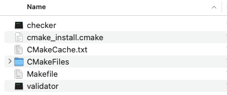
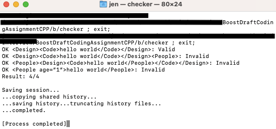

# What is the project about?
This project is a interview take home coding test from BoostDraft. 
# Goal: 
Create a console application with the following specifications
- Input: an XML string (at least one character)
    - The XML string should be passed as the first command line argument.
- Output: `Valid` if given XML is valid, otherwise `Invalid` with a new line
    - Use standard output.
A string is valid XML string if it satisfies the following two rules:
- Each starting element must have a corresponding ending element.
- Elements must be well nested, which means that the element which starts first must end last.
  For example,`<tutorial><topic>XML</topic></tutorial>` is considered correct, while`<tutorial><topic>XML</tutorial></topic>` is not.

# What approach I used and why?
The goal is validate for basic well-formed XML(proper opening and closing tags and well nested elements), To achieve this, a simpler function is sufficient.

My approach is to use a stack to track the opening and closing tags:
- push an opening tag into the stack and pop it when you find the corresponding closing tag.
- if the stack is empty at the end and tags are properly closed in order the XML is valid.

Why use a stack?
Using a stack in this XML parsing situation is highly beneficial due to the inherent nature of XML structure and the stack's LIFO(last in, first out) behavior.
1. **Tag Matching**: A stack easily matches each opening tag with its corresponding closing tag.
2. **Order Validation**: It ensures tags are closed in the correct order (Last In, First Out).
3. **Simple and Efficient**: A stack provides a straightforward way to track XML structure without complex algorithms.
4. **Error Detection**: It helps quickly identify unclosed or mismatched tags.
5. **Handling Nested Structures**: Stacks are well-suited for managing the nested nature of XML tags.

# Getting Started
My build environment:
- OS: macOS
- IDE: VSCode 

## Prerequisites
### Install Cmake 
Since this project uses CMake to build the C++ project, you need to install CMake on your system.
One way to install CMake is to use [Homebrew](https://brew.sh/).

In your terminal:
1. Install Homebrew
```sh
$ /bin/bash -c "$(curl -fsSL https://raw.githubusercontent.com/Homebrew/install/HEAD/install.sh)"
```
1. Install cmake via Homebrew
```sh
$ brew install cmake`
```

## Build project
Download the project to your system and build it:
```sh
# Make directory to build
$ mkdir b && cd b
$ cmake ..
$ make
```

Note: If you get `**error:** **use of undeclared identifier 'tuple'**` , you might need to add these lines in `CMakeList.txt`
```
set(CMAKE_CXX_STANDARD 11)
set(CMAKE_CXX_STANDARD_REQUIRED True)
```

After building successfully, you will see `checker` in your directory:


Double click `checker` and see the result:



